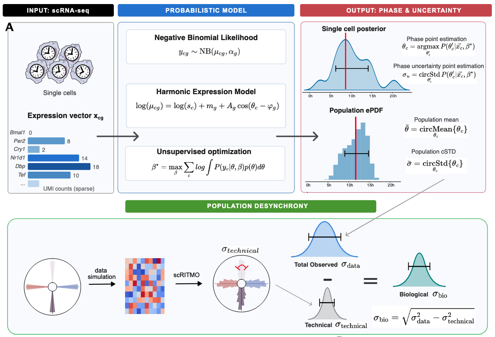

<p align="center">
  
  <h1 align="center">scRITMO</h1>
  <p align="center">
    <strong>Single-cell circadian phase inference and desynchrony quantification</strong>
  </p>
  <p align="center">
    <a href="https://www.python.org/downloads/"></a>
    <a href="https://pytorch.org/"></a>
    <a href="#license"></a>
    <a href="https://www.biorxiv.org/content/10.64898/2026.03.30.715278v1.full"></a>
  </p>
</p>

---

**scRITMO** is an unsupervised probabilistic framework for inferring circadian phases from single-cell RNA-seq data and quantifying biological desynchrony at the population level, described in our preprint: [*Inferring circadian phases and quantifying biological desynchrony across single-cell transcriptomes*](https://www.biorxiv.org/content/10.64898/2026.03.30.715278v1.full) (bioRxiv, 2026).

Unlike methods that only provide point estimates, scRITMO computes a **full posterior phase distribution** for each cell — yielding both a phase estimate and a principled measure of uncertainty. It further enables the **separation of biological phase dispersion from technical noise** through simulation-calibrated variance decomposition.

## Overview

### The problem

Circadian rhythms are fundamental to mammalian physiology, but studying them at single-cell resolution is challenging. scRNA-seq captures each cell only once (a destructive measurement), and low transcript capture efficiency (~5–15% of the transcriptome) makes it hard to distinguish true biological variation in circadian phase from technical noise — especially for core clock genes, which tend to be lowly expressed transcription factors.

### What scRITMO does

scRITMO addresses this by:

1. **Probabilistic phase inference** — Models single-cell counts with a Negative Binomial likelihood and a harmonic expression model. Each cell's circadian phase θ is treated as a latent variable, and a full posterior P(θ|x) is computed via marginal likelihood maximization. The phase estimate is taken as the posterior mode, and the uncertainty as the posterior circular standard deviation (cSTD).
2. **Expanded gene sets** — Core clock genes alone create "phase attractor zones" at low sequencing depths where inferred phases artificially cluster. scRITMO mitigates this by incorporating a broader, cell-type-specific set of rhythmically expressed genes (Extended-Set) beyond the core clock circuit.
3. **Desynchrony quantification** — A variance decomposition framework separates the observed population phase spread (σ_data) into a technical component (σ_technical, estimated via matched simulations) and the true biological desynchrony (σ_bio), enabling meaningful cross-condition comparisons.

<p align="center">
  
</p>

scRITMO takes single-cell expression vectors as input, fits a Negative Binomial likelihood with a harmonic expression model to obtain gene parameters β\*, and marginalizes over each cell's latent phase to recover a full posterior P(θ|x). From this posterior it extracts both a point estimate (the MAP phase) and its uncertainty (circular standard deviation), which aggregate into a population-level phase distribution and its circular mean/cSTD.

### Core model

The `ContextModel` is the central class. It implements:

- **Negative Binomial count model** with gene-specific dispersion
- **Single-harmonic expression profiles**: `log(μ_cg) = log(s_c) + m_g + A_g cos(θ_c − φ_g)`
- **Marginal likelihood optimization** — cell phases are integrated out under a uniform prior, and gene parameters are learned via gradient descent (Adam)
- **Posterior inference** — after training, each cell gets a full posterior distribution, from which the MAP estimate and cSTD uncertainty are extracted

## Installation

```bash
# Clone the repository
git clone https://github.com/AndreaSalati/scRITMO.git
cd scRITMO

# Create a conda environment with Python 3.11
conda create -n scritmo-env python=3.11 -y
conda activate scritmo-env

# Install the package (PyTorch included by default)
pip install -e .
```

## Requirements

- Python >= 3.11
- PyTorch (installed by default, needed for the `scritmo.ml` module)
- See `pyproject.toml` for the full dependency list

## Citation

If you use scRITMO in your work, please cite:

```bibtex
@article{scritmo2026,
  title   = {Inferring circadian phases and quantifying biological desynchrony across single-cell transcriptomes},
  author  = {Salati, Andrea and others},
  journal = {bioRxiv},
  year    = {2026},
  doi     = {10.64898/2026.03.30.715278},
  url     = {https://www.biorxiv.org/content/10.64898/2026.03.30.715278v1.full}
}
```